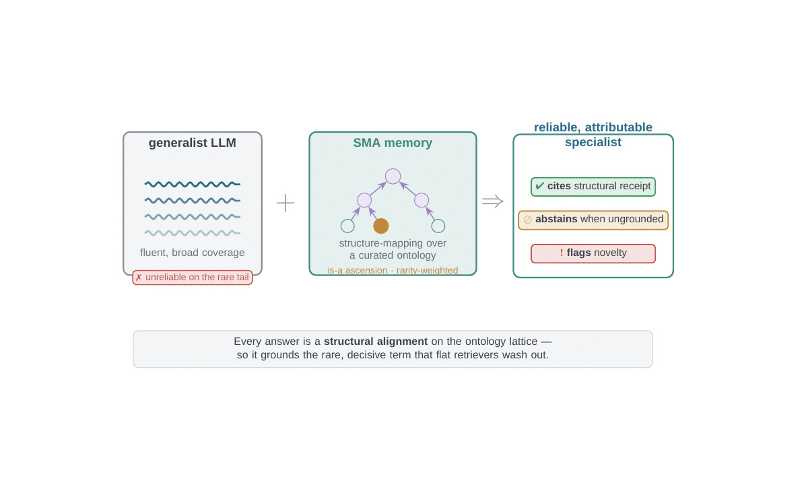
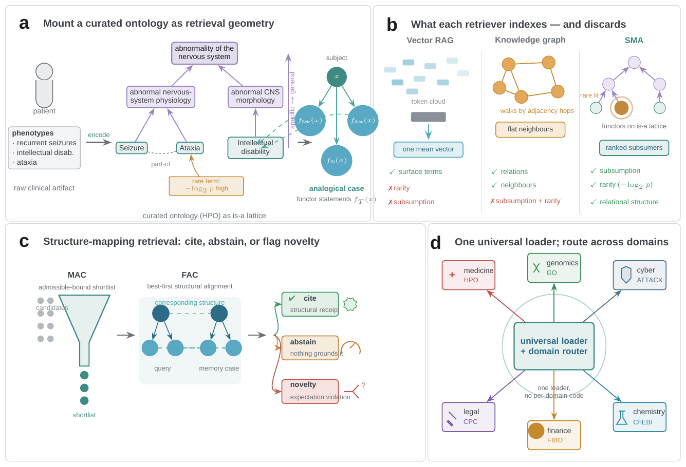
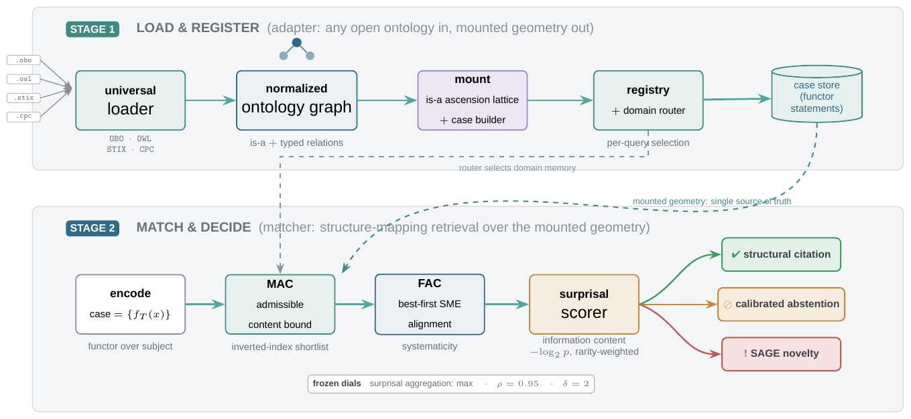

# SMA-1: Structure-Mapping Agentic Memory

[](https://github.com/ayazkhan27/SMA-1/actions/workflows/ci.yml)
[](https://pypi.org/project/structuremappingmemory/)
[](LICENSE)
[](https://huggingface.co/spaces/zephyr27/SMA-1-demo)

**Structure-mapping memory grounds language models in curated ontologies.** SMA is
a retrieval *memory* that grounds a generalist LLM in a **curated,
expert-maintained ontology**, retrieving by **logical structure** — subsumption
(is-a) and higher-order relations — that vector RAG and knowledge graphs discard. Holding the language model and prompt fixed and swapping
only the memory, the SMA-grounded agent becomes **more accurate, more selective,
and more structurally attributable** than vector RAG: it cites its evidence
structurally, abstains when nothing grounds the case, and flags novelty —
capabilities flat retrievers structurally lack. On the real-domain benchmarks the
measured advantage is carried by bounded is-a subsumption plus information-content
weighting (the higher-order relational machinery is decisive only on a synthetic
structure-only control), and it vanishes where no discriminative ontology applies.



> A structure-mapping memory over a curated ontology grounds a generalist LLM by
> the subsumption hierarchy and rarity weighting that flat retrievers wash out —
> and the structural alignment itself is what survives when there is no surface
> signal at all.

---

## What it does

| Capability | SMA | Vector RAG | Knowledge graph |
|---|:--:|:--:|:--:|
| Rare / long-tail retrieval (rarity-weighted) | ✅ | ✗ averages rarity away | ✗ |
| Cross-vocabulary / zero-lexical-overlap match | ✅ | ✗ | partial |
| Subsumption (is-a) reasoning | ✅ | ✗ | ✗ no ascension |
| Structural citation (checkable provenance) | ✅ | ✗ | partial |
| Calibrated abstention | ✅ | ✗ cosine always "high" | ✗ |
| Novelty / expectation-violation flag | ✅ | ✗ | partial |

One **universal loader** ingests any open OBO/OWL/STIX/CPC ontology (is-a hierarchy
plus typed relations, no OWL reasoning); a **registry + domain router** select
across domains. We mount eleven ontologies spanning seven knowledge areas
(≈594,000 concepts) behind one shared retrieval core plus thin per-domain data
adapters.



## Headline results (honest)

On a **memory-swap benchmark** where only the retriever varies, SMA beats a strong
RAG + KG baseline suite on the rare/long-tail slice across five domains:

| Domain | SMA tail top-5 | best RAG | Δ tail top-5 | Cliff's δ | Holm-significant |
|---|:--:|:--:|:--:|:--:|:--:|
| Medicine (HPO/MONDO) | 0.949 | 0.606 | **+0.343** | 0.333 | yes |
| Finance (US-GAAP) | 0.418 | 0.231 | **+0.187** | 0.167 | yes |
| Genomics (GO) | 0.849 | 0.682 | **+0.167** | 0.156 | yes |
| Legal (CPC, all-query) | 0.941 | 0.870 | **+0.071** | 0.064 | yes |
| Cyber (ATT&CK) | 0.766 | 0.749 | +0.017 | 0.073 | directional* |

\* Cyber survives Holm across domains but not a conservative
Bonferroni-over-baselines selection correction (p=0.035 → 0.17); reported as
directional. End to end (medicine, LLM-in-the-loop), the SMA-grounded agent is the
most accurate (0.342 vs dense 0.100 vs closed-book 0.017), most faithful in
citation, and uniquely separates known from unknown entities (grounding AUROC 0.79
vs vector RAG's near-chance 0.55).

**Where it does not help (reported, not hidden):** SMA *ties* a bespoke ontology
information-content oracle (Phenomizer) rather than beating it; and on
**flat single-record tabular prediction** (hospital readmission, credit-card
fraud, the Elliptic Bitcoin graph-fraud probe) there is no discriminative
subsumption ontology to mount, so SMA reaches only parity and a flat
logistic-regression baseline wins. The advantage is specific to structure.

## How it works



1. **Adapter** — a universal loader parses any open ontology into a normalized
   graph, **mounts** the is-a hierarchy as an *ascension lattice* (specific terms
   match general ones with penalty ρ^dist) and the typed relations as higher-order
   cases, and registers them behind a per-query domain router.
2. **Matcher** — a case (functors over a subject) is screened by a certified
   **MAC** admissible-content bound, aligned by best-first structure-mapping
   (**FAC/SME**), and scored by a rarity-weighted **information-content** (−log₂ p)
   surprisal scorer.
3. **Decision** — the alignment yields a **structural citation**, a **calibrated
   abstention**, or a **novelty flag** (SAGE expectation violation).

## Quick start

```bash
pip install structuremappingmemory        # from PyPI (import name: sma)
```

### Use as an MCP server (Codex, Claude Code, Claude Desktop)

SMA ships a Model Context Protocol server so an agentic LLM can mount your ontologies and
retrieve **structural analogs + cite-or-abstain + novelty** as tools. One command, zero
install (via [`uv`](https://docs.astral.sh/uv/)):

```bash
codex mcp add sma -- uvx structuremappingmemory     # Codex CLI
claude mcp add sma -- uvx structuremappingmemory    # Claude Code
```

`/mcp` to confirm, then ask it to `mount_ontology` / `retrieve` / `novelty`. Full guide,
manifest config, and alternatives (pipx / pip): [`docs/MCP.md`](docs/MCP.md).

Or for development, with the evaluation/encoder extras:

```bash
python -m venv .venv && . .venv/bin/activate
pip install -e ".[encoders,eval]"
pytest -m "gate_G0 or gate_G1 or gate_G2 or gate_G3 or gate_G4 or gate_G5 or gate_G6"
sma ui                       # FastAPI + Gradio demo
```

Raw datasets are not tracked. Fetch checksum-verified external data with:

```bash
python scripts/fetch_datasets.py --manifest data/manifests/datasets.json
```

Reproduce the confirmatory tables/figures from committed CSVs:

```bash
python scripts/figures_paper.py      # main-text figures
python scripts/figures_ed.py         # Extended Data figures
```

All result numbers in the paper trace to `reports/confirmatory/*.csv`; runs are
deterministic (`PYTHONHASHSEED=0`, paired bootstrap seeded at 12345).

## Repository layout

| Path | Contents |
|---|---|
| `sma/ontology/` | universal ontology adapter (loaders, mount, registry, router) — **frozen `adapter-v1`** |
| `sma/eval/agentic/` | memory-swap retrieval harness + baseline arms |
| `sma/eval/agentic_qa/` | end-to-end LLM-QA agent (pre-registration v2) |
| `scripts/` | dataset fetch, figure/table generators, ablations |
| `reports/confirmatory/` | all result CSVs (every paper number sources here) |
| `paper/manuscript/` | `sma_nature_mi.tex` — the manuscript (Nature `sn-jnl` template) |
| `release/` | model card, dataset card, HuggingFace Space |

## Paper & citation

The manuscript (`paper/manuscript/sma_nature_mi.tex`, intended for *Nature Machine
Intelligence*) is built on the official Springer Nature `sn-jnl` template. To cite
this software, see [`CITATION.cff`](CITATION.cff).

## License

Apache-2.0. All mounted ontologies are openly licensed and version-pinned; we
redistribute only derived gold labels, never restricted source records (see
Extended Data and `release/model_card.md`).
